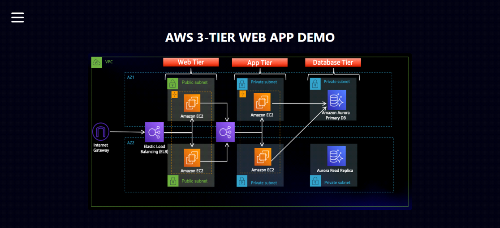

# 🚀 Three-Tier Web Application Deployment on AWS

A highly available, fault-tolerant three-tier web application architecture deployed on AWS — built hands-on to understand real-world cloud infrastructure design, from networking to compute to database.

   

## 📑 Table of Contents
- [Overview](#-overview)
- [Architecture](#-architecture)
- [Networking (VPC)](#-1-networking-vpc)
- [Security](#-2-security)
- [Database Tier](#-3-database-tier)
- [App Tier](#-4-app-tier)
- [Web Tier](#-5-web-tier)
- [Screenshots](#-screenshots)
- [Tech Stack](#-tech-stack)
- [Key Learnings](#-key-learnings)
- [Credit](#-credit)

## 📖 Overview

This project simulates a production-style web application split into three isolated layers — **Web Tier**, **App Tier**, and **Database Tier** — each in its own subnet, communicating securely across two Availability Zones for high availability and fault tolerance.

## 🏗️ Architecture

| Layer | Purpose | AWS Services |
|---|---|---|
| **Web Tier** | Public-facing layer serving the React.js frontend via NGINX | EC2, ALB, Auto Scaling |
| **App Tier** | Private backend layer running the Node.js API | EC2, Internal ALB, Auto Scaling |
| **Database Tier** | Private, Multi-AZ managed database | Amazon Aurora (MySQL-Compatible) |

## 🌐 1. Networking (VPC)

- Custom VPC with **6 subnets** across **2 Availability Zones** (public web, private app, private database)
- Internet Gateway for public access + 2 NAT Gateways for private subnet outbound traffic
- Dedicated route tables per subnet tier

📸 [See VPC & Subnet Screenshots](screenshots/vpc-subnets.png)

## 🔒 2. Security

- 5 layered security groups (public ALB → web tier → internal ALB → app tier → database), following least-privilege access
- IAM roles for EC2 to access S3 and use Systems Manager Session Manager (no SSH keys needed)

📸 [See Security Group Screenshots](screenshots/security-groups.png)

## 🗄️ 3. Database Tier

- Multi-AZ Amazon Aurora (MySQL-compatible) RDS cluster in private subnets
- DB subnet group spanning 2 Availability Zones for automatic failover
- Sample `transactions` table created and tested

📸 [See Database Screenshots](screenshots/database.png)

## ⚙️ 4. App Tier

- EC2 instances running a Node.js backend on port 4000
- PM2 for process management and auto-restart
- Internal Application Load Balancer + Auto Scaling Group (min 2, max 2)

📸 [See App Tier Screenshots](screenshots/app-tier.png)

## 🖥️ 5. Web Tier

- EC2 instances running NGINX, serving the React.js frontend
- NGINX configured as reverse proxy to the internal load balancer
- Internet-facing Application Load Balancer + Auto Scaling Group

📸 [See Web Tier & Live App Screenshots](screenshots/web-tier.png)

## 📸 Screenshots

| Component | Preview |
|---|---|
| VPC & Subnets | [View](screenshots/vpc-subnets.png) |
| Running EC2 Instances | [View](screenshots/ec2-instances.png) |
| Aurora Database | [View](screenshots/database.png) |
| Live Website | [View](screenshots/live-app.png) |

## 🛠️ Tech Stack

**Cloud:** AWS (VPC, EC2, RDS/Aurora, IAM, S3, ALB, Auto Scaling, CloudWatch)
**Backend:** Node.js
**Frontend:** React.js
**Web Server:** NGINX
**Database:** MySQL (Amazon Aurora)

## 📚 Key Learnings

- Designing secure, multi-tier network architecture on AWS
- Configuring high availability using Load Balancers and Auto Scaling
- Managing Multi-AZ databases with Amazon Aurora
- Using IAM roles for secure, keyless EC2-to-AWS communication

## 🙏 Credit

Built by following AWS's official three-tier architecture workshop as a base, with full hands-on implementation, configuration, and testing on my own AWS account.

